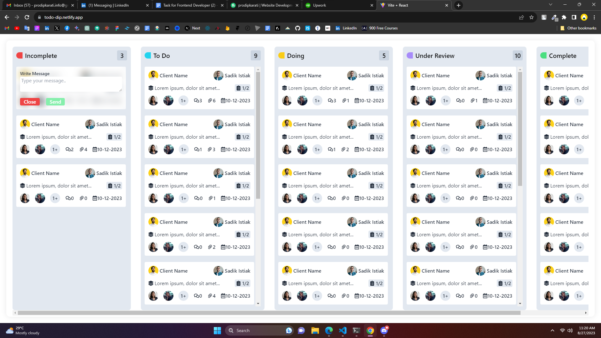

# Todo-Dip Management

[](https://todo-dip.netlify.app/)

## Overview

Todo Management is a web application designed to streamline your task and file management. It offers a user-friendly interface for uploading, organizing, and tracking tasks along with attached files. The project is built using ReactJS, JavaScript, Express.js, and MongoDB, and it incorporates various features to enhance task management and collaboration.

## Features

- **Single Page Design with Horizontal Scroll**: Navigate seamlessly through tasks and files using the intuitive single-page design with horizontal scrolling.

- **Scrollable Cards within Cards**: Enhance user experience by enabling scrollable content within individual task cards.

- **Modal Attachment and Multiple Uploads**: Easily attach files to tasks using a modal interface. Support multiple file uploads and maintain a comprehensive list view.

- **API for File Upload and Message Upload**: Develop a robust API that facilitates efficient file uploads and allows users to attach messages to tasks.

## Technologies Used

- ReactJS
- JavaScript
- Express.js
- MongoDB

## API

The project's API provides endpoints to manage tasks, attachments, and messages efficiently:

- **Retrieve All Todos**: Fetch all tasks in the collection.

  - Endpoint: `/todos`
  - Example API Call: `GET /todos`

- **Retrieve Todos by Category**: Get tasks belonging to a specific category.

  - Endpoint: `/todo/:category`
  - Example API Call: `GET /todo/work`

- **Add Attachments to Todo**: Attach files to a task by providing a category, ID, and attachment array.

  - Endpoint: `/add-attachment/:category/:id`
  - Example API Call:
    ```
    POST /add-attachment/incomplete/123
    ```

- **Add Message to Todo**: Add messages to tasks by specifying a category, ID, and message object.
  - Endpoint: `/add-message/:category/:id`
  - Example API Call:
    ```
    POST /add-message/complete/456
    ```
